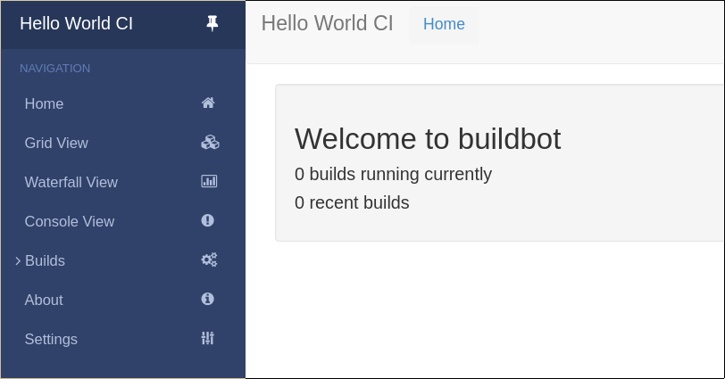

.. _first-run-label:

==================================================
First Run
==================================================

Goal
--------------------------------------------------

このチュートリアルはゼロから最初の buildbot master と worker を出来るだけ早く、初期設定を変更せずに実行します。

このチュートリアルの全ては、手っ取り早い満足感 (instant gratifiction) と、5分間での経験です：このプロジェクトは機能し、システムの学習に時間を割くか真剣に検討すべきだと、5分間で説得したいと思います。
このチュートリアルでは、設定およびコードの変更は行いません。

このチュートリアルは、 Unix で実施されていると仮定していますが、 Windows にも適応できると思います。

virtualenv_ のおかげで、スタンドアローンな環境への buildbot のインストールはとても簡単です。
Docker_ に慣れている場合は、\ `docker版のインストラクション <https://docs.buildbot.net/current/tutorial/docker.html#first-run-docker-label>`_\ 
も用意しています。

このチュートリアル内にあるシェルのブロックはそれぞれ、ターミナルへ直接コピーして貼り付けできるはずです。

.. _Docker: https://docker.com

.. _getting-code-label:

Getting ready
--------------------------------------------------

コードを自分のマシンに持って来る方法はいくつもあります。
ここでは最も簡単な方法を使用します： virtualenv_ の中で ``pip`` を使用します。
これには、 virtualenv の中に全て収めることで、自分のオペレーティングシステムを汚染しないという利点があります。

このやり方を実行できるように、以下のものをインストールする必要があります：

* Python_ と、その開発パッケージ
* virtualenv_

.. _Python: https://www.python.org/
.. _virtualenv: https://pypi.python.org/pypi/virtualenv

なるべく、これらのインストールには自分のディストリビューションのパッケージマネージャーを使用します。

さらに、 virtualenv と pip がインターネットから他のプロジェクトをダウンロードする必要があるため、インターネットへの接続も有効にする必要があります。 master と builder の daemon は、テストする repo を HTTPS で取得するために ``github.com`` に接続できる必要があります；もし prox を使う必要がある場合は、例えば各 daemon を開始する前に ``export HTTPS_PROXY=http://localhost:9080`` をシェルで実行して、確実に ``HTTPS_PROXY`` または ``ALL_PROXY`` 環境変数のいずれかを自分の proxy に設定してください。

.. note::

    root でのアクセスは buildbot には不要です。
    このチュートリアル中のコマンドは通常の、特権を持たないユーザで実行してください。

Creating a master
--------------------------------------------------

最初の必要なステップは master 用の virtualenv を作成することです。
違いをデモするために master と worker のディレクトリも分けます：

.. code-block:: bash

  mkdir -p ~/tmp/bb-master
  cd ~/tmp/bb-master

Python 3の場合：

.. code-block:: bash

  python3 -m venv sandbox
  source sandbox/bin/activate

ここまで準備ができたら、 buildbot のインストールが必要です：

.. code-block:: bash

  pip install --upgrade pip
  pip install 'buildbot[bundle]'

buildbot の活動は設定ファイルで制御されます。
今回はサンプルの設定ファイルを変更せずに使用します：

.. code-block:: bash

  mv master/master.cfg.sample master/master.cfg

最後に、 master を開始します：

.. code-block:: bash

  buildbot start master

すると、この端末で master からのログ情報が見られるでしょう。
このような行で終わっているはずです：

.. code-block:: none

    2014-11-01 15:52:55+0100 [-] BuildMaster is running
    The buildmaster appears to have (re)started correctly.

ここからは、ポート 8010 の http://localhost:8010/ で稼働している web の status ページへ自由に訪ずれることができます。

ここ時点で master は、コマンドを実行するためには (少なくとも) １つの worker を必要とします。
それについては、次のセクションへ進みましょう！

Creating a worker
--------------------------------------------------

worker は master から送られてきたコマンドを実行します。
このチュートリアルでは、 buildbot/hello-world プロジェクトを例として使用していきます。
その結果として、 worker はコードをチェックアウトするために git_ コマンドへのアクセスが必要になります。
しかしながら、それは別のコンピュータで実行しても全く問題ありません - *worker* コンピュータが *master* コンピュータへ接続できるかぎりは：

.. code-block:: bash

  mkdir -p ~/tmp/bb-worker
  cd ~/tmp/bb-worker

Python 2の場合：

.. code-block:: bash

  virtualenv --no-site-packages sandbox
  source sandbox/bin/activate

Python 3の場合：

.. code-block:: bash

  python3 -m venv sandbox
  source sandbox/bin/activate

``buildbot-worker`` コマンドをインストールします：

.. code-block:: bash

   pip install --upgrade pip
   pip install buildbot-worker
   # required for `runtests` build
   pip install setuptools-trial

ここで worker を作成します：

.. code-block:: bash

  buildbot-worker create-worker worker localhost example-worker pass

.. note:: もし別のコンピュータから作成するように決定した場合は、 ``localhost`` を master が稼働しているコンピュータ名に置き換えます。

ユーザ名 (``example-worker``) とパスワード (``pass``) は、 :file:`master/master.cfg` にあるものと同じにすべきです；今回もそうなっているか、 ``c['worker']`` セクションを調べて検証します：

.. code-block:: bash

  cat ../bb-master/master/master.cfg

そして最後に、 worker を開始します：

.. code-block:: bash

  buildbot-worker start worker

worker の出力をチェックします。
このような行で終了しているはずです：

.. code-block:: none

  2014-11-01 15:56:51+0100 [-] Connecting to localhost:9989
  2014-11-01 15:56:51+0100 [Broker,client] message from master: attached
  The worker appears to have (re)started correctly.

一方で、他の端末から、 master のログ (master ディレクトリ中の :file:`twisted.log`) の中で、このような行が見られるはずです：

.. code-block:: none

  2014-11-01 15:56:51+0100 [Broker,1,127.0.0.1] worker 'example-worker' attaching from IPv4Address(TCP, '127.0.0.1', 54015)
  2014-11-01 15:56:51+0100 [Broker,1,127.0.0.1] Got workerinfo from 'example-worker'
  2014-11-01 15:56:51+0100 [-] bot attached

この時点で、以下のような web ページを見られる http://localhost:8010 へ行けるはずです：

左にある "Builds" をクリックしてサブメニューを開き、ちょうど開始させた worker が master に接続していることを見るために `Builders <http://localhost:8010/#/builders>`_ をクリックします：

.. image:: _images/builders.png
   :alt: builder runtests is active.

この時点で master は hello-world への新しいコミットを静かに待っています。
しかしながら、これは、それほど頻繁には起きません。
次のセクションでは、どうやって手動でビルドを開始するかを見ていきます。

ここからは、新しいことを試して欲しいと思っています (We just wanted to get you to dip your toes in the water)。
最初のステップまで連れて来ることは容易ですが、設定を触らずに行けるところまで行けるのはこの辺りまでです。

味見は既にできました、しかし、もっと興味を持っているはずです。
設定を変更し実際のビルドを行う次のチュートリアルで、もう少しステップアップしましょう。
:ref:`クイックツアー <quick-tour-label>` に続きます。

.. _git: https://git-scm.com/

