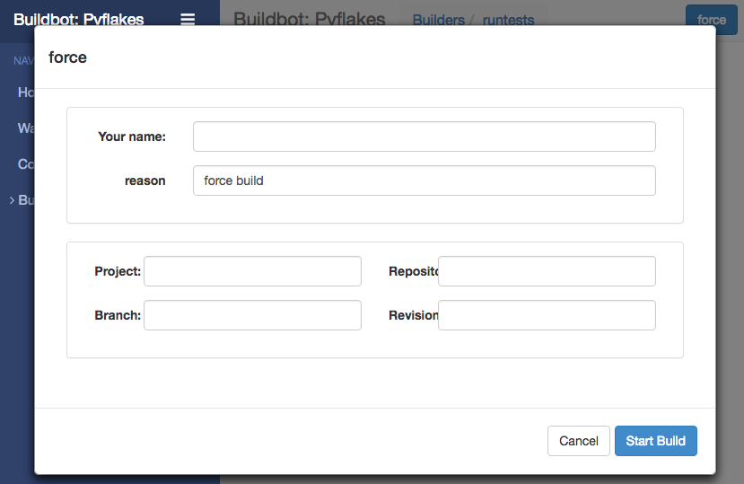
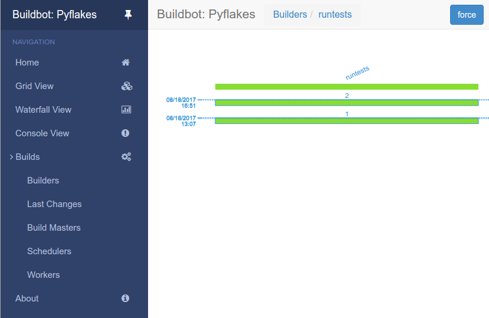

.. _quick-tour-label:

==================================================
A Quick Tour
==================================================

Goal
--------------------------------------------------

このチュートリアルは、サンプル設定の中にあるコメントでヒントが示されていた buildbot の機能 (features) のいくつかに関するクイックツアーで、 :ref:`first-run-label` チュートリアルを拡張します。
標準設定の一部をシンプルに変更して、有効にした機能を説明します。

チュートリアルの一部として、 buildbot で実際のビルドを少し実施します。

このセクションでは以下のことをどのように行うか説明します：

- シンプルな設定変更を行い、それを有効にする
- 設定エラーを処理する
- ビルドを強制する
- IRCボットを有効にして制御する
- sshを使ったデバッグを有効にする
- 「try」スケジュールを追加する

Setting Project Name and URL
--------------------------------------------------

シンプルに、 buildbot プロジェクトの名前と URL をどこでカスタマイズするか見てみることから始めましょう。

:ref:`first-run-label` チュートリアルで残してきたものから続けます。

新しい端末を開いて、以前作成したものと同じ sandbox へ最初に入ります (ここでの ``$EDITOR`` は vim、gedit、または emacs など好きなものを選んでください)：

.. code-block:: bash

  cd ~/tmp/bb-master
  source sandbox/bin/activate
  $EDITOR master/master.cfg

それでは、以下のような *PROJECT IDENTITY* と印がつけられているセクションを探します::

  ####### PROJECT IDENTITY

  # the 'title' string will appear at the top of this buildbot installation's
  # home pages (linked to the 'titleURL').

  c['title'] = "Hello World CI"
  c['titleURL'] = "https://buildbot.github.io/hello-world/"

もし希望するなら、変更したときに何がおきるか見るために、これらのいずれのリンクも好きなように変更できます。

変更後、端末の中へ移動して以下のように入力します：

.. code-block:: bash

  buildbot reconfig master

master のログから来る、以下のようなたくさんの行が見られるでしょう：

.. code-block:: none

    2011-12-04 10:11:09-0600 [-] loading configuration from /home/dustin/tmp/buildbot/master/master.cfg
    2011-12-04 10:11:09-0600 [-] configuration update started
    2011-12-04 10:11:09-0600 [-] builder runtests is unchanged
    2011-12-04 10:11:09-0600 [-] removing IStatusReceiver <WebStatus on port tcp:8010 at 0x2aee368>
    2011-12-04 10:11:09-0600 [-] (TCP Port 8010 Closed)
    2011-12-04 10:11:09-0600 [-] Stopping factory <buildbot.status.web.baseweb.RotateLogSite instance at 0x2e36638>
    2011-12-04 10:11:09-0600 [-] adding IStatusReceiver <WebStatus on port tcp:8010 at 0x2c2d950>
    2011-12-04 10:11:09-0600 [-] RotateLogSite starting on 8010
    2011-12-04 10:11:09-0600 [-] Starting factory <buildbot.status.web.baseweb.RotateLogSite instance at 0x2e36e18>
    2011-12-04 10:11:09-0600 [-] Setting up http.log rotating 10 files of 10000000 bytes each
    2011-12-04 10:11:09-0600 [-] WebStatus using (/home/dustin/tmp/buildbot/master/public_html)
    2011-12-04 10:11:09-0600 [-] removing 0 old schedulers, updating 0, and adding 0
    2011-12-04 10:11:09-0600 [-] adding 1 new changesources, removing 1
    2011-12-04 10:11:09-0600 [-] gitpoller: using workdir '/home/dustin/tmp/buildbot/master/gitpoller-workdir'
    2011-12-04 10:11:09-0600 [-] GitPoller repository already exists
    2011-12-04 10:11:09-0600 [-] configuration update complete

    Reconfiguration appears to have completed successfully.

重要な行は、新しい設定をロード中と伝えている一番上にある行と、更新が完了したと言っている一番下のものです。

このとき、もし `the waterfall page <http://localhost:8010/#/waterfall>`_ へ戻ると、プロジェクト名が変更したものになっていることが確認でき、ページの一番下にあるプロジェクト名のURLをクリックしたときは、設定ファイルで設定したリンクへ移動するはずです。

Configuration Errors
--------------------------------------------------

buidbot を設定するとき間違えるのはよくあることなので、そのような場合に何が起きて、エラーを治すために何ができるかを、ここで見ておいた方が良いでしょう。

設定ファイルを再び開き、以下の2行で最初の引用符を削除するして、文法エラーを発生させます：

..
    Format a `none` since this is not a valid Python code

.. code-block:: none

  c[title'] = "Hello World CI"
  c[titleURL'] = "https://buildbot.github.io/hello-world/"

これで Python の ``SyntaxError`` が発生します。それでは、先へ進んで buildmaster を再設定します：

.. code-block:: bash

  buildbot reconfig master

今回は、以下のような出力になりまｓ：

.. code-block:: none

    2015-08-14 18:40:46+0000 [-] beginning configuration update
    2015-08-14 18:40:46+0000 [-] Loading configuration from '/data/buildbot/master/master.cfg'
    2015-08-14 18:40:46+0000 [-] error while parsing config file:
	    Traceback (most recent call last):
	      File "/usr/local/lib/python2.7/dist-packages/buildbot/master.py", line 265, in reconfig
		d = self.doReconfig()
	      File "/usr/local/lib/python2.7/dist-packages/twisted/internet/defer.py", line 1274, in unwindGenerator
		return _inlineCallbacks(None, gen, Deferred())
	      File "/usr/local/lib/python2.7/dist-packages/twisted/internet/defer.py", line 1128, in _inlineCallbacks
		result = g.send(result)
	      File "/usr/local/lib/python2.7/dist-packages/buildbot/master.py", line 289, in doReconfig
		self.configFileName)
	    --- <exception caught here> ---
	      File "/usr/local/lib/python2.7/dist-packages/buildbot/config.py", line 156, in loadConfig
		exec f in localDict
	    exceptions.SyntaxError: EOL while scanning string literal (master.cfg, line 103)

    2015-08-14 18:40:46+0000 [-] error while parsing config file: EOL while scanning string literal (master.cfg, line 103) (traceback in logfile)
    2015-08-14 18:40:46+0000 [-] reconfig aborted without making any changes

    Reconfiguration failed. Please inspect the master.cfg file for errors,
    correct them, then try 'buildbot reconfig' again.

今回は、設定に誤りがあることが明らかです。
幸運にも、 Buildbot の master は間違った設定は無視して、以前の設定で走り続けます。

メッセージは十分明確なので、設定ファイルを再び開いて、エラーを修正し、 master を reconfig してください。

Your First Build
--------------------------------------------------

この時点で恐らくこう考えているのではないでしょうか： 「これだけの時間を費やして、まだひとつもビルドしていない？このプロジェクトの名前 (訳注： buildbot と名前に build を含んでいる) は何だったんだ？」

`Builders <http://localhost:8010/#/builders>`_ ページ上で、 runtests リンクをクリックしてください。
builder ページと、以下のダイアログボックスを呼び出す、青い「force」ボタンを見ることができるでしょう：

*Start Build*  をクリックしてください - 今回は、どの入力欄も記入する必要はありません。
次に、 `view in waterfall <http://localhost:8010/#/waterfall?show=runtests>`_ をクリックしてくださ。

すると、以下のように表示されるでしょう：

.. image:: _images/runtests-success.png
   :alt: an successful test run happened.

Enabling the IRC Bot
--------------------

buildbot には、 channel に join するよう伝えて buidbot の状態の報告をコントロールできる IRC ボットが含まれています。

.. note:: セキュリティ上の注意

    あなたの irc channel へアクセスできるまたは bot を PM できるあらゆるユーザがビルドを作成および停止できることに注意してください :bug:`3377`。

最初に、好きな IRC クライアントを開始して、 irc.freenode.net に接続して空の channel へ join します。
この例では、 ``#buildbot-test`` を使用するので、その channel へ join します。
( *注意：メインの buildbot channel へは join しないでください* )

:file:`master.cfg` を編集して *BUILDBOT SERVICE* セクションを探してください。
そのセクションの最後に以下の行を追加します::

  c['services'].append(reporters.IRC(host="irc.freenode.net", nick="bbtest",
                                     channels=["#buildbot-test"]))

build master を reconfigure してから、以下を実施します：

.. code-block:: bash

  grep -i irc master/twistd.log

ログ出力は以下のような行を含んでいるはずです：

.. code-block:: none

  2016-11-13 15:53:06+0100 [-] Starting factory <buildbot.reporters.irc.IrcStatusFactory instance at 0x7ff2b4b72710>
  2016-11-13 15:53:19+0100 [IrcStatusBot,client] <buildbot.reporters.irc.IrcStatusBot object at 0x7ff2b5075750>: I have joined #buildbot-test

このとき、bot が join していることを、 IRC クライアントで見られるはずです。
IRC channel の中で、以下のように入力して：

.. code-block:: none

  bbtest: commands

bot がサポートするコマンドの一覧を取得します。

どのイベントに対して通知ができるのか調べるために、ある種のイベントを通知するよう bot に伝えましょう：

.. code-block:: none

  bbtest: help notify

それでは、いくつかイベント通知を設定しましょう：

.. code-block:: irc

  <@lsblakk> bbtest: notify on started finished failure
  < bbtest> The following events are being notified: ['started', 'failure', 'finished']

それでは、 web インタフェースへ戻って、もうひとつの build を強制します。または (alternatively)、bot へビルドを強制するよう依頼します：

.. code-block:: irc

  <@lsblakk> bbtest: force build --codebase= runtests
  < bbtest> build #1 of runtests started
  < bbtest> Hey! build runtests #1 is complete: Success [finished]

このとき、web インタフェースでも新しいビルドを見ることができます。

全部のドキュメントは :bb:reporter:`IRC` で利用可能です。

Setting Authorized Web Users
--------------------------------------------------

初期設定ではビルドの作成や停止など、 web インタフェースから誰でもどんなタスクも実行できます。これをあるユーザへ制限するには、以下の箇所を探して::

  c['www'] = dict(port=8010,
                   plugins=dict(waterfall_view={}, console_view={}))

以下を追加します::

  c['www']['authz'] = util.Authz(
          allowRules = [
              util.AnyEndpointMatcher(role="admins")
          ],
          roleMatchers = [
              util.RolesFromUsername(roles=['admins'], usernames=['Alice'])
          ]
  )
  c['www']['auth'] = util.UserPasswordAuth([('Alice','Password1')])

さらなる詳細は、 :ref:`Web-Authentication` を見てください。

Debugging with Manhole
--------------------------------------------------

インタラクティブな python シェル の manhole を使ってある程度デバッグができます。
それは buildmaster のアカウントにフルアクセス (ファイルの変更および削除を含む) を与えるので、弱いまたは容易に推測できるパスワードでは有効にするべきではありません。

使用するためには virtualenv に追加パッケージをいくつかインストールする必要があります。

.. code-block:: bash

  cd ~/tmp/bb-master
  source sandbox/bin/activate
  pip install -U pip
  pip install cryptography pyasn1

manhole サーバのために SSH ホストキーを生成する必要もあります。

.. code-block:: bash

  mkdir -p /data/ssh_host_keys
  ckeygen -t rsa -f /data/ssh_host_keys/ssh_host_rsa_key

master.cfgの中で以下の箇所を見つけてください::

  c = BuildmasterConfig = {}

その後に manhole のデバッグモードを有効にするために以下を追加します::

  ####### DEBUGGING
  from buildbot import manhole
  c['manhole'] = manhole.PasswordManhole("tcp:1234:interface=127.0.0.1","admin","passwd", ssh_hostkey_dir="/data/ssh_host_keys/")

master を再起動した後、 master に ssh って入りインタラクティブな Python シェルを使用できるようになります：

.. code-block:: bash

  ssh -p1234 admin@127.0.0.1
  # enter passwd at prompt

.. note::
    pyasn1-0.1.1 リリースにはバグがあり、開始時に以下に似た例外が生じます：
    this on startup:

    .. code-block:: none

        exceptions.TypeError: argument 2 must be long, not int

    もしこれを見つけたら、一時的な解決策は pyasn1 の以前のバージョンをインストールすることです：
    of pyasn1:

    .. code-block:: bash

        pip install pyasn1-0.0.13b

もし、どの worker が接続していて、どの builder がそれらの worker に割り当てられているかチェックしたいときは、以下のようしてできるはずです::

  >>> master.workers.workers
  {'example-worker': <Worker 'example-worker', current builders: runtests>}

`dir(x)` やヘルパー関数 `show(x)` を使用してオブジェクトをより詳細に調べることができます。

Adding a 'try' scheduler
--------------------------------------------------

buildbot は開発者がソースコードのバージョン管理システムへコミットせずにテスト用のパッチを提出する方法を含んでいます。
(これは、いくつかのOSやアーキテクチャをプロジェクトにとって、とても便利です。)

これをセットアップするには、以下の数行を master.cfg に追加します::

  from buildbot.scheduler import Try_Userpass
  c['schedulers'] = []
  c['schedulers'].append(Try_Userpass(
                                      name='try',
                                      builderNames=['runtests'],
                                      port=5555,
                                      userpass=[('sampleuser','samplepass')]))

それから、 :bb:cmdline:`try` コマンドを使用して変更を提供できます。

hello-world を 1 行変更して、試してみましょう。標準でツリーを追跡するようにします （Let's try this out by making a one-line change to hello-world, say, to make it trace the tree by default）:

.. code-block:: bash

  git clone https://github.com/buildbot/hello-world.git hello-world-git
  cd hello-world-git/hello
  $EDITOR __init__.py
  # change 'return "hello " + who' on line 6 to 'return "greets " + who'

それから、 buildbot の ``try`` コマンドを実行します：

.. code-block:: bash

  cd ~/tmp/bb-master
  source sandbox/bin/activate
  buildbot try --connect=pb --master=127.0.0.1:5555 --username=sampleuser --passwd=samplepass --vc=git

これは Git の最新ソースに対する ``git diff`` を実行した結果の patch を、ビルドおよびテストのためにサーバへ送信します。

それでは `waterfall <http://localhost:8010/#/waterfall>`_ ページに戻って、 runtests のリンクをクリックし、下へスクロールしてください。
もうひとつのビルドが変更を反映して開始ししていることを (そして結果としてツリーのパースで一杯になっているテストの標準出力を) 確認できるはずです。
「try」ジョブとして、ジョブの「Reason」がリストになっていて、 blamelist が空になっているでしょう (The "Reason" for the job will be listed as "'try' job", and the blamelist will be empty)。

変更の作者を表示させるには、  ``buildbot tryy`` で``--who=emailaddr`` オプションを使用して email アドレスを渡します。

変更の説明を表示させるには、 ``buildbot try`` で ``--properties=comment="this is a comment"`` を使用します。

プライベートな username/password データベースの代わりに ssh を使用するには、 :bb:sched: `Try_Jobdir` を参照してください。
